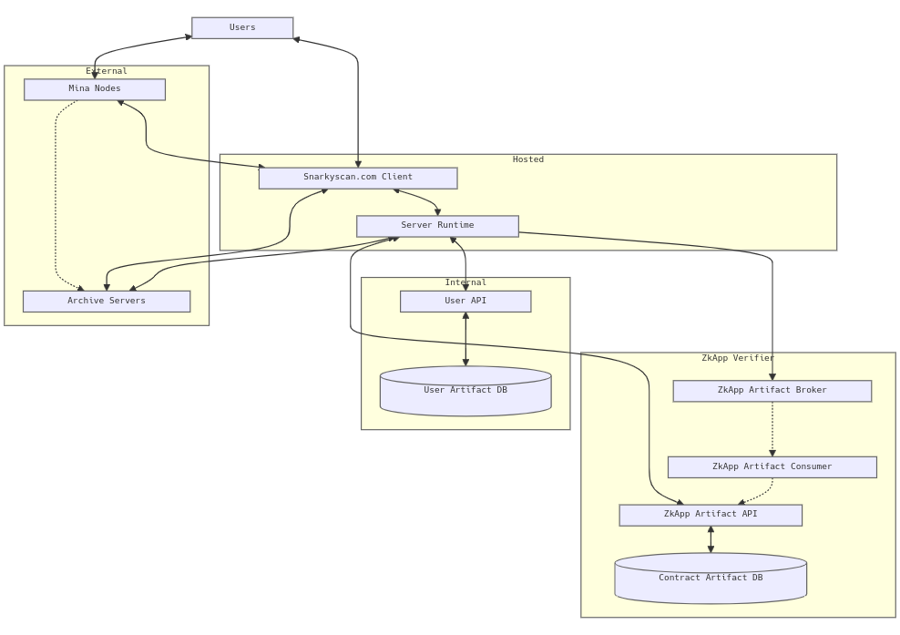

# Snarkyscan 💚 + Mina 🤍

Try the canonical deployment at <https://snarkyscan.com>

## Overview

Snarkyscan is a fast self-hostable Mina protocol blockchain explorer designed for interactions with ZkApps. It provides robust tools for interacting with deployed ZkApps, a window into the ZkApp Artifact system for interacting with ZkApps on Mina which have verified their contract code.

## Architecture

[]

## Getting Started

### Finding blockchain information

There are three primary routes end users will find themselves visting often.

#### /block/[blockNumber]

```
sample: https://snarkyscan.com/block/
```

#### /address/[publicKey]

```
sample: https://snarkyscan.com/address/
```

#### /tx/[hash]

```
sample: https://snarkyscan.com/tx/
```

## Why Mina?

Mina is currently preparing to deploy ZkApps to their mainnet. This will unlock new programmatic use cases for particpants in the ecosystem. With the introduction of external code, end users need a service to decode interactions with the apps and ensure those they want to interact with are safe. Snarkyscan fills that need by providing them the ability to explore information on chain, verify their additions.

## User Guide

Use the canonical deployment when in doubt <https://snarkyscan.com>

If you are running your service locally, run the development server:

```bash
npm run dev
# or
yarn dev
# or
pnpm dev
# or
bun dev
```

Open [http://localhost:3000](http://localhost:3000) with your browser to see the result.
